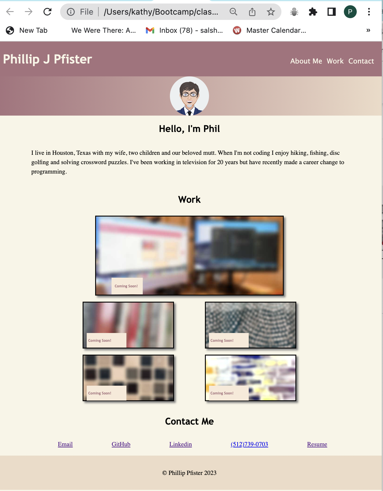

# Portfolio for Phillip Pfister

This web document is a responsive website with links to various projects that I have created during my enrollment in Rice University's Coding Bootcamp.  This repo is designed to be viewed by potential employers who would like to see examples of my abilities.

## Installation

Navigate to the website: [https://phil-pfister.github.io/Phillip_Pfister_Portfoilo/](https://phil-pfister.github.io/Phillip_Pfister_Portfoilo/#contactMe) to view this portfolio

The page looks like this:

## Usage

There are links in the navigation bar that will take you to specific parts of the document and links to other websites that were created by me or with me as part of a group. There are also links at the bottom of the page with various ways to contact me or view my resume and social media presence. I created and deployed a "under contruction" page for items that haven't been created yet to use as a placeholder. The link to that repository is here: [Under Construction Repo](https://github.com/Phil-Pfister/under_construction)

## Credits

I used what I learned in the classroom as well as information from MDN docs and W3 schools websites as well as Stack Overflow.

[MDN](https://developer.mozilla.org/en-US/)

[w3school](https://www.w3schools.com/)

[StackOverflow](https://stackoverflow.com/)

I used Avatar maker to create my avatar.

[Avatarmaker.com](avatarmaker.com)

## License

MIT License

© 2023 Phillip Pfister

Permission is hereby granted, free of charge, to any person obtaining a copy of this software and associated documentation files (the “Software”), to deal in the Software without restriction, including without limitation the rights to use, copy, modify, merge, publish, distribute, sublicense, and/or sell copies of the Software, and to permit persons to whom the Software is furnished to do so, subject to the following conditions:

The above copyright notice and this permission notice shall be included in all copies or substantial portions of the Software.

THE SOFTWARE IS PROVIDED “AS IS”, WITHOUT WARRANTY OF ANY KIND, EXPRESS OR IMPLIED, INCLUDING BUT NOT LIMITED TO THE WARRANTIES OF MERCHANTABILITY, FITNESS FOR A PARTICULAR PURPOSE AND NONINFRINGEMENT. IN NO EVENT SHALL THE AUTHORS OR COPYRIGHT HOLDERS BE LIABLE FOR ANY CLAIM, DAMAGES OR OTHER LIABILITY, WHETHER IN AN ACTION OF CONTRACT, TORT OR OTHERWISE, ARISING FROM, OUT OF OR IN CONNECTION WITH THE SOFTWARE OR THE USE OR OTHER DEALINGS IN THE SOFTWARE.

